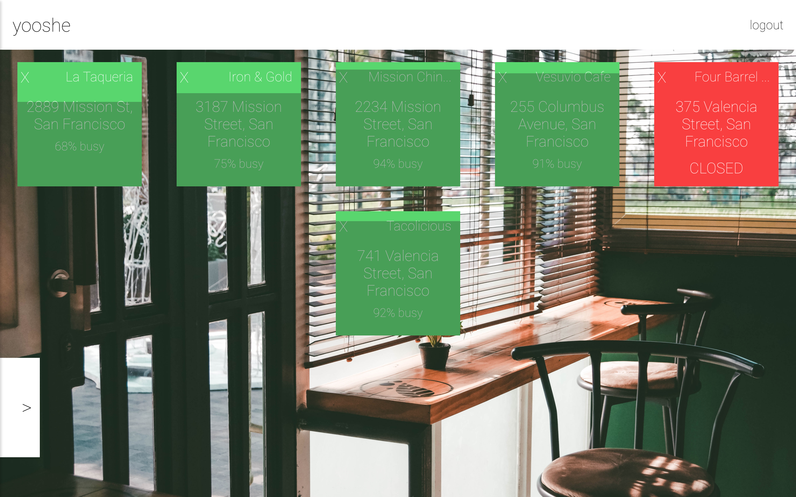
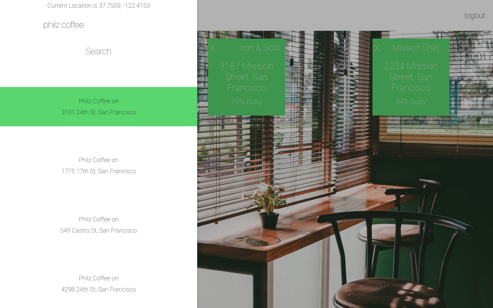

# yooshe

[yooshe on Heroku](https://yooshe.herokuapp.com)

yooshe is a single page application built with React + Redux, Socket.io, Express.js, GooglePlacesAPI, and MongoDB. yooshe gives the user a place to add their usual places to eat or drink, and provides real-time data on how busy those places are. yooshe's design was influenced by Apple's [Human Interface Guidelines](https://developer.apple.com/design/).

## Features and Implementation

### Places
Users can quickly see all of their usual spots on one page. Place data is supplied by GooglePlacesAPI and 'busyData' is supplied by [busy-hours](https://www.npmjs.com/package/busy-hours). Data is updated every half an hour through websockets.

### Adding Places
yooshe will find the user's current location, or prompt for the zipcode. A user's query will return all the places with a mathching name, sorted by distance. This is supplied by GooglePlacesAPI.

### Upcoming Features
+ Users can set usuals around their regular locations(home, work, school, etc.).
+ Native iOS app.
+ Chrome Extension/Custom Tab.
